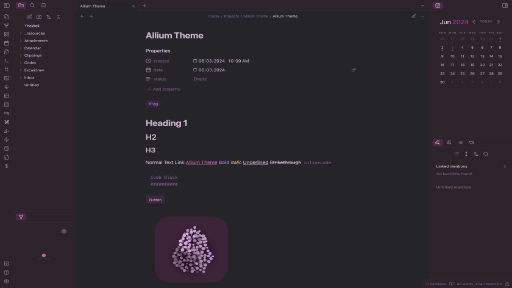

# Allium

Allium is a theme inspired by allium flowers, mainly Allium atropurpureum, which has beuatiful shades of red and purple.

I will flesh all this out more in the future, but for now I just wanted to get it published.

